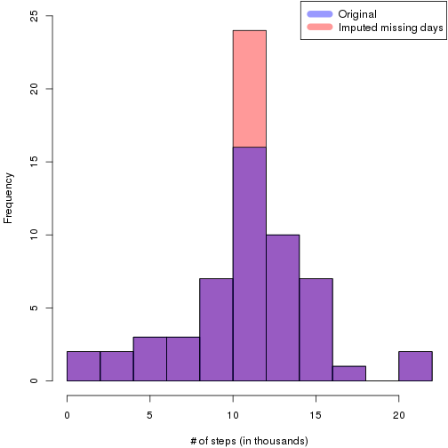
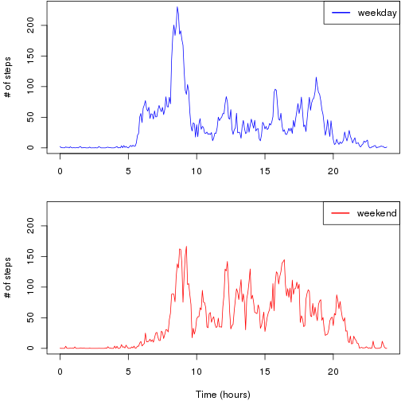

# Reproducible Research: Peer Assessment 1
This research investigates the data from a personal activity monitoring device,
which collected the number of steps an individual took at 5 minute intervals
through out the day.

The raw data provided is available at the [course website][1] and consists
of two months of data from an anonymous individual collected during the months
of October and November, 2012 and include the number of steps taken in 5 minute
intervals each day.


## Loading and preprocessing the data
The raw data is available in the `activity.csv` file in the repository
as a CSV-file with 3 fields:

- *steps:* Number of steps taking in a 5-minute interval (missing values are coded as NA)
- *date:* The date on which the measurement was taken in YYYY-MM-DD format
- *interval:* Identifier for the 5-minute interval in which measurement was taken

Let's load the dataset and add the following variables:

- *minutes:* The number of minutes passed since midnight for a better time scale
- *weekday:* The week day name


```r
data <- read.csv('activity.csv', colClasses=c('integer', 'Date', 'integer'))

# add new variables
data <- transform(data
                  , minutes = (interval %/% 100) * 60 + interval %% 100
                  , weekday = weekdays(date))
```


## What is mean total number of steps taken per day?
First, let's determine how many steps *in total* an individual takes daily.


```r
steps.daily <- aggregate(data$steps, by = data['date'], FUN = sum)

print(daily.mean <- mean(steps.daily$x, na.rm = TRUE))
## [1] 10766.19

median(steps.daily$x, na.rm = TRUE)
## [1] 10765

par(mar = c(4,4,0,0)+0.1)
hist(steps.daily$x/1e3, breaks = 10
    , xlab = '# of steps (in thousands)', main = '')
abline(v = daily.mean/1e3, col = 'blue', lwd = 2)
```

 

We can see that the distribution is fairly **normal** with both the *mean* 
and *median* close to **11 thousand steps** taken daily.

There is also a right outlier of over 20 thousand steps taken in a day, which
may indicate some outstanding activity during a couple of days.


## What is the average daily activity pattern?
Let's find the typical daily activity pattern, averaged across all days.


```r
pattern <- aggregate(data$steps
                     , by = c(data['minutes'], data['interval'])
                     , FUN = mean, na.rm=TRUE)

print(peak.row <- pattern[which(pattern$x == max(pattern$x)),])
##     minutes interval        x
## 104     515      835 206.1698

with(pattern, {
    par(mar = c(4,4,0,0)+0.1)
    plot(minutes/60, x, type = 'l'
         , xlab = 'Time (hours)'
         , ylab = '# of steps'
    )
})
```

 

We can see that there is almost **no activity from 10 p.m. to 5:30 a.m**, which
must indicate *sleeping time*. There is also a **definite peak at 8:35 a.m.**
(interval 835) of 206 steps on average,
which might indicate going to work.

## Imputing missing values
As we can see in the first rows of the dataset, there are missing values.
Let's analyze them.

```r
na.values <- data[is.na(data$steps),]

# count NA values
nrow(na.values)
```

```
## [1] 2304
```

Let's plot the distributions to find where the missing values are gathered.

```r
with(na.values, {
    par(mfrow = c(2,1), mar = c(4,4,0,0)+0.1)
    hist(minutes/60, breaks=24, main = '', xlab = 'Time (hours)')
    hist(date, breaks=60, main = '', xlab = 'Date')
})
```

 

The dataset contains 2304 missing values, which makes up
13%. As we can see from the distribution
of the missing values across *the time intervals* and *dates*, all missing values
are represented with some **whole days**.

The presence of missing days may introduce bias into some calculations
or summaries of the data, so let's find more about these days and try to choose
the imputing algorithm.


```r
na.days <- aggregate(na.values$date
                     , by=c(na.values['date'], na.values['weekday'])
                     , FUN=length)
print(na.days)
```

```
##         date   weekday   x
## 1 2012-11-09    Friday 288
## 2 2012-11-30    Friday 288
## 3 2012-10-01    Monday 288
## 4 2012-10-08    Monday 288
## 5 2012-11-10  Saturday 288
## 6 2012-11-04    Sunday 288
## 7 2012-11-01  Thursday 288
## 8 2012-11-14 Wednesday 288
```

We can see that the missing days are random and they are not gathered all
together or have the same day of week. Thus, we can replace the missing value
for a certain interval with the value of the same interval from the typical
day activity pattern.


```r
data2 <- data
f <- function(index) {
    if (is.na(data2$steps[index]))
        pattern$x[which(pattern$interval == data2$interval[index])]
    else
        data2$steps[index]
}
data2$steps <- sapply(seq_along(data2$steps), f)
```

Let's explore the resulting data.


```r
steps.daily2 <- aggregate(data2$steps, by = data2['date'], FUN = sum)

mean(steps.daily2$x)
## [1] 10766.19

median(steps.daily2$x)
## [1] 10766.19

par(mar = c(4, 4, 0, 0) + 0.1)
hist(steps.daily2$x/1e3, breaks = 10, col=rgb(1,0,0,0.4), ylim=c(0,25)
    , xlab = '# of steps (in thousands)', main = '')
hist(steps.daily$x/1e3, breaks = 10,  col=rgb(0,0,1,0.4), add=TRUE
    , xlab = '# of steps (in thousands)', main = '')
legend('topright'
       , legend = c('Original', 'Imputed missing days')
       , col = c(rgb(0,0,1,0.4), rgb(1,0,0,0.4))
       , lwd = 10)
```

 

We can see that replacing the missing days with an average daily pattern
does not affect the mean or median, while the **unimodality** of the distribution
of the total number of steps taken daily becomes more distinct.


## Are there differences in activity patterns between weekdays and weekends?
Usually the daily activity on weekends differs from weekdays. Let's see if
it is true here. We will create a factor variable with two levels: “weekday”
and “weekend” indicating whether a given date is a weekday or weekend day.


```r
data2$day <- factor(ifelse(data2$weekday %in% c('Saturday', 'Sunday')
                           , 'weekend', 'weekday'))

week.pattern <- aggregate(data2$steps
                          , by = c(data2['day'], data2['minutes'], data2['interval'])
                          , FUN = mean)
weekday.pattern <- subset(week.pattern, day == 'weekday')
weekend.pattern <- subset(week.pattern, day == 'weekend')
ylim <- range(c(weekday.pattern$x, weekend.pattern$x))

par(mfrow = c(2,1), mar = c(4,4,0,0)+0.1)
with(weekday.pattern, {
     plot(minutes/60, x, type = 'l', col='blue', ylim = ylim
     , ylab = '# of steps', xlab = '')
     legend('topright', 'weekday', col = 'blue', lwd = 2)
})
with(weekend.pattern, {
     plot(minutes/60, x, type = 'l', col='red', ylim = ylim
     , xlab = 'Time (hours)'
     , ylab = '# of steps')
     legend('topright', 'weekend', col = 'red', lwd = 2)
 })
```

 

There is some difference in the daily activity pattern between weekdays and
weekends. The sleeping time on weekends seems the same, but there is less
activity in the morning, comparing to weekdays. There is still a peak
at approx. 8:30 a.m. on weekends, but it is lower and there are some other
definite peaks during the day and there is more activity before going to sleep
between 8 p.m. and 10 p.m.

[1]: https://d396qusza40orc.cloudfront.net/repdata%2Fdata%2Factivity.zip
